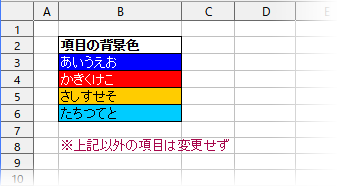

# Excelファイルのセル色情報を抽出する

こういうExcelファイルから



次のようなテキストを出力するPerlスクリプトです。

```javascript
bgColor["あいうえお"] = '#0000ff';
bgColor["かきくけこ"] = '#ff0000';
bgColor["さしすせそ"] = '#ffe000';
bgColor["たちつてと"] = '#00c0ff';
```

Webシステムを開発していて、
「ここの項目に背景色を付けて欲しい…」と依頼されることがあり、
しかもExcelファイルで渡されるので(笑)、
簡単にプログラムソース化するために作りました。

## プラットフォーム

Microsoft Excel がインストールされているWindows上で動きます。

## 使用方法

> perl **listBgcolor.pl** 入力Excelファイル名

結果は標準出力に出ます。  
出力対象のセルは、何か文字が入力されていて、
かつ「塗りつぶしの色」が設定されているセルです。  
「塗りつぶしなし」のセルは対象外です。

## 出力形式のカスタマイズ

出力するテキストの形式は listBgcolorFormat.pm の
format() 関数で決定しています。  
引数(**セルの値**, **16進6桁の色コード**) を受け取って、
1行分の文字列を返却します。  
Javascriptの連想配列を想定したものだが、
ここを書き換えれば他のブログラム言語にも対応可能。

